# TaskbarExtensionsVBA

Windows 7 以降で追加されたタスクバーに関するいくつかの機能を、拡張機能ファイル(dll)を経由して、VBAで操作できるようにしたものです。<br>
[タスク バーの拡張機能 - Win32 apps | Microsoft Learn](https://learn.microsoft.com/ja-jp/windows/win32/shell/taskbar-extensions)

VBAは非常に親しみやすく業務で根強く使われている一方、
比較的新しい Windows API には対応が難しいという課題があります。
例えば、タスクバーに関する機能（進捗バー、サムネイルボタン、ジャンプリストなど）は、
VBA単体で扱うにはハードルが高く、実用的ではありません。

そこで、C++ 製の DLL を介して、VBA から簡単にタスクバー操作を行う方法を提案します。
通常のVBAの延長として扱えるため、VBA開発者の方でもすぐに活用可能です。

✅ DLLファイルの使用が許可されている環境であれば、一度導入してみてはいかがでしょうか。
VBAの可能性を一気に広げる選択肢になるかもしれません。

あるいは、お遊び感覚で、タスクバーをいじるのも良いかも知れません。

## DEMO

### [進行状況バー](https://learn.microsoft.com/ja-jp/windows/win32/shell/taskbar-extensions#progress-bars)

| シチュエーション例 | 動作イメージ | 
| ---------------- | ------------ | 
| データ準備→処理中→終了 |        | 
| 処理中→一時中断→再開 |        |
| 処理中→エラー→終了 |        |

タスクバー ボタンに表示される進行状況インジケーターの種類と状態を設定できます。

### [アイコン オーバーレイ](https://learn.microsoft.com/ja-jp/windows/win32/shell/taskbar-extensions#icon-overlays)

| シチュエーション例 | 動作イメージ | 
| ---------------- | ------------ | 
| 検索中… | 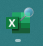       | 
| ファイル移動中… | 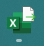       | 
| 処理中→エラー→終了 |        | 

こんな感じで、ステータスの表現が可能です。<br>
プログレスバーと合わせて表現すると良いと思います。

### [ジャンルリストのカスタム](https://learn.microsoft.com/ja-jp/windows/win32/shell/taskbar-extensions#customizing-jump-lists)

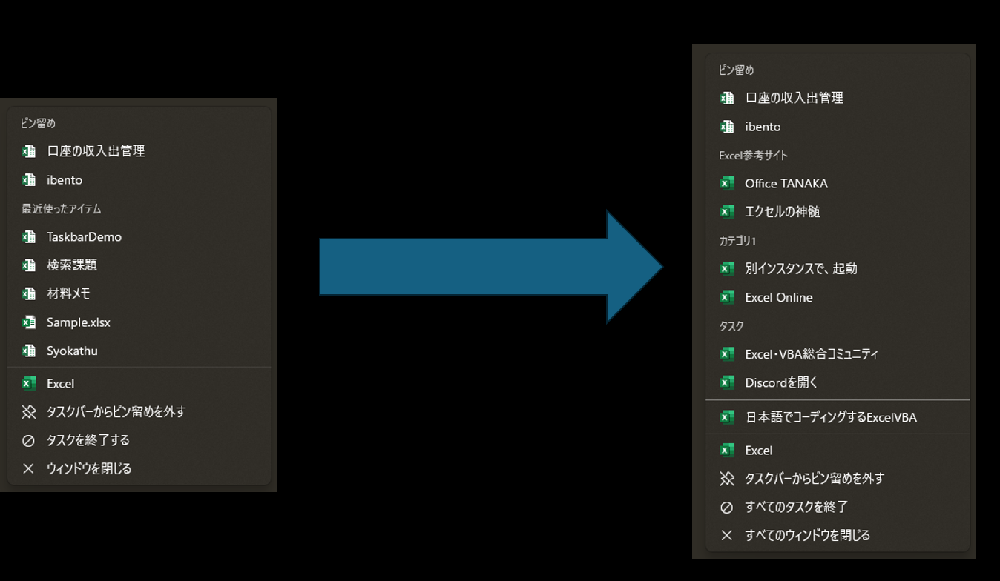

通常では「ピン留め」「最近使ったアイテム」しか見かけませんがこれを使うことで、任意のカテゴリ、タスク が扱えます。

### [サムネイル ツール バー](https://learn.microsoft.com/ja-jp/windows/win32/shell/taskbar-extensions#thumbnail-toolbars)

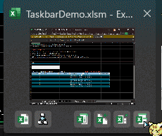

音楽プレイヤーなど一部のアプリでは、タスクバーのアイコンにマウスカーソルを乗せると、
サムネイルの下部に「再生」「停止」などの操作ボタンが表示されます。

そのサムネイル ツールバー機能をExcelに実装します。

## Features

- DLLインポートにより、数行で手軽に進捗状況とステータスの表現が可能です。ユーザーフォーム作ってプログレスバーを埋め込んで、呼び出して…　という手間が省けます。
- ステータスに使えるアイコンソースファイルは、下記に対応しています
  - .icoファイル: 単独のアイコンファイル。
  - .exeファイル: 実行ファイル内に埋め込まれたリソースアイコン。
  - .dllファイル: DLL内に埋め込まれたリソースアイコン。

## Requirement

以下で検証済みです。

- Microsoft 365 Excel 64bit
- Windows 10 , 11 64bit

タスクバーのプログレスバー自体は、Windows 7から実装されたものですが当本人、所有していないためWin 10未満のOSは、未検証です…<br>
Office製品も同様です。

## Load DLL

WindowsAPIの「LoadLibrary関数」を使って、読み込みます。

```bas
hDll = LoadLibrary("TaskbarExtensions.dll")
```

実際に使う場合は、"Excelファイル(.xlsm)の存在するディレクトリ"というような[動的な場所を設定する仕組み](https://liclog.net/vba-dll-create-5/)で読み込むことをおすすめします。

```bas
'動的にDLLを取得するためのWinAPI
Private Declare PtrSafe Function LoadLibrary Lib "kernel32" Alias "LoadLibraryA" (ByVal lpLibFileName As String) As LongPtr

Private Sub Workbook_Open()

    Dim hDll As LongPtr
    Dim sFolderPath As String
    
    'DLLファイルを保存するフォルダパスを設定
    sFolderPath = ThisWorkbook.Path
    
    'DLLﾌｧｲﾙを読み込む
    hDll = LoadLibrary(sFolderPath & "\" & "TaskbarExtensions.dll")　'DLLファイルフルパス

    debug.print hDll
End Sub
```

hDll の中身が、0 以外であれば読み込み、成功です。

## Usage

基本的には、[ここにある](doc/SampleForVBA) モジュールやクラスファイルをインポートするだけで済みます。詳しい内容は、次の項で

## UpdateTaskbarProgress

> [!IMPORTANT]
> 事前に、[Mod04_ProgressBarTaskbar.bas](doc/SampleForVBA/Modules/Mod04_ProgressBarTaskbar.bas) のインポートをして下さい。

### サンプルコード

```bas
Sub TaskbarProgressTest()
    ' DLL関数の呼び出し
    UpdateTaskbarProgress 50
End Sub
```

上記のサンプルを実行すると、このようになります。進捗値 50% と表現できます。<br>
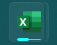

### 引数の説明

| 名称            | 説明                                                                             | 既定値 |
| --------------- | -------------------------------------------------------------------------------- | --- |
| current         | 現在の進捗値                                                                     | ※必須 |
| maximum         | 最大(ゲージMax)とする値。                                       | 100 |
| Status          | プログレスバーの状態(0,1,2,4,8 のいずれか)                                        | 2 (TBPF_NORMAL) |
| hwnd            | 適用させるウィンドウハンドルを指定。<br>基本は設定不要です。 | Application.hwnd |

### Status について

説明は[こちらから引用](https://learn.microsoft.com/ja-jp/windows/win32/api/shobjidl_core/nf-shobjidl_core-itaskbarlist3-setprogressstate)しています

| 値  | 説明                                                                                                                                              | イメージ | 
| --- | ------------------------------------------------------------------------------------------------------------------------------------------------- | -------- | 
| 0   | TBPF_NOPROGRESS<br>進行状況の表示を停止し、ボタンを通常の状態に戻します。                                                                         |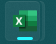| 
| 1   | TBPF_INDETERMINATE<br>進行状況インジケーターのサイズは拡大しませんが、タスク バー ボタンの長さに沿って繰り返し循環します。                        || 
| 2   | TBPF_NORMAL<br>進行状況インジケーターのサイズは、完了した操作の推定量に比例して左から右に大きくなります。                                         || 
| 4   | TBPF_ERROR<br>進行状況インジケーターが赤に変わり、進行状況をブロードキャストしているいずれかのウィンドウでエラーが発生したことを示します。        |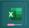| 
| 8   | TBPF_PAUSED<br>進行状況インジケーターが黄色に変わり、進行状況は現在いずれかのウィンドウで停止されていますが、ユーザーが再開できることを示します。 |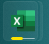| 

## UpdateTaskbarOverlayIcon

> [!IMPORTANT]
> 事前に、[Mod01_BadgeUpdateManager.bas](doc/SampleForVBA/Modules/Mod01_BadgeUpdateManager.bas) のインポートをして下さい。

### サンプルコード

```bas
Sub SetOverlayIconFromDLLExample()
    Dim dllPath As String
    Dim iconIndex As Long
    Dim description As String
    
    ' 任意のアイコンデータがあるフルパス(ico,dll,exe に対応)
    'dllPath = "C:\Program Files\Microsoft Office\root\Office16\XLICONS.EXE"
    dllPath = "C:\Windows\System32\shell32.dll"
    'dllPath = "C:\Users\user\Downloads\sample.ico"

    ' アイコンのインデックス（DLL,exe内のアイコン番号）
    iconIndex = 240
    
    ' アイコンの説明テキスト
    description = "Custom Icon from DLL"
    
    ' DLL関数を呼び出し、タスクバーにオーバーレイアイコンを設定
    UpdateTaskbarOverlayIcon dllPath, iconIndex, description
End Sub
```

上記のサンプルをWin 11で実行すると、このようになります。<br>
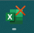

### 引数の説明

| 名称            | 説明                                                                             | 既定値 |
| --------------- | -------------------------------------------------------------------------------- | --- |
| dllPath         | 任意のアイコンデータがあるフルパス | ※必須 |
| iconIndex       | アイコンのインデックス（DLL,exe内のアイコン番号）<br>icoファイルの場合は、この設定を無視します。| 0 |
| description     | アクセシビリティ用の代替テキスト | 空文字 |
| hwnd            | 適用させるウィンドウハンドルを指定。<br>基本は、設定不要です。 | Application.hwnd |

> [!TIP]
> ステータスアイコンを除去するには、 iconIndex を -1 にすればOKです。

## BadgeUpdaterDLL / BadgeUpdaterCmd

> [!CAUTION]
> この機能はUWP版を前提に設計している影響で、DeskTop版では動作しません。
> 検証時は、[こちらをインストール](https://www.microsoft.com/ja-jp/microsoft-365/excel#Plans-pricing)する必要があります。

### サンプルコード

```bas
Sub BadgeUpdaterExample()
    'DLL経由で、実行
    BadgeUpdaterDLL 30

	'Shell 経由の場合(動作が遅い場合があります)
	'Shell BadgeUpdaterCmd (30) ,vbhide
End Sub
```

上記のサンプルをWin 11で実行すると、このようになります。<br>
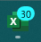

### 引数の説明

| 名称            | 説明                                                                             | 既定値 |
| --------------- | -------------------------------------------------------------------------------- | --- |
| BadgeID      | \<badge value="X"/> の X の値を決めるIDです。詳細は次のセクションで     | ※必須 |
| appId           | [appUserModelID](https://www.ka-net.org/blog/?p=6250) を指定します。調べ方は、割愛します | Microsoft.Office.Excel_8wekyb3d8bbwe!microsoft.excel |

### badgeValue のついて

指定数値、識別子に応じて、バッチアイコンを変化する仕様にしています。
詳細は、[こちら](https://learn.microsoft.com/ja-jp/windows/apps/design/shell/tiles-and-notifications/badges)をどうぞ

| BadgeID      | バッチアイコン                                                                             | 
| --------- | -------------------------------------------------------------------------------- | 
| 100以上   |      | 
| 1 ~ 99    |            | 
| bv_none | バッジ表示なし(リセット)                                                                                                                      | 
| bv_activity |            | 
| bv_alert    |            | 
| bv_alarm    |            | 
| bv_available |            | 
| bv_away      |            | 
| bv_busy      |            | 
| bv_newMessage |            | 
| bv_paused    |            | 
| bv_playing   |            | 
| bv_unavailable |            | 
| bv_error     |            | 
| bv_attention |            | 

> [!WARNING]
> アプリを閉じる前に、`<badge value="none"/>` といった情報を送らないと、常にステータスアイコンが残り続けるので注意

## BadgeUpdaterForWin32

Win32アプリでも、通知数アイコンを表示する機能です。

> [!CAUTION]
> `playing` 等のステータスアイコンは非対応です。`UpdateTaskbarOverlayIcon` で対応して下さい。

### 引数の説明

| 名称            | 説明                                                                             | 既定値 |
| --------------- | -------------------------------------------------------------------------------- | --- |
| BadgeID      | 1 ~ 99 で、通知数アイコン。0 で消去です     | ※必須 |
| hwnd           | ウィンドウハンドル | application.hend |

### サンプルコード

```bas
Sub BadgeUpdaterExample()
    BadgeUpdaterForWin32 30
End Sub
```

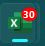

> [!NOTE]
> 現時点では、背景色の色は変えれません

## ジャンルリストの登録方法

大まかな流れは下記になります

1. [Mod05_JumplistControl.bas](doc/SampleForVBA/Modules/Mod05_JumplistControl.bas) をインポート
2. `Registration` 関数で、必要な設定値を登録
3. `Import` 関数で、ジャンルリストを登録

> [!NOTE]
> ジャンルリストの実体は、ショートカットファイルのようなイメージです。ここで、マクロ実行はできません。

### Registration 

ここで、ジャンルリストの登録データを定義します

| 引数名           | 説明                                                                 | 既定値 |
|------------------|----------------------------------------------------------------------| ----- |
| 表示名           | ジャンプリストにそのまま表示される名前を指定します。                | ※必須
| ショートカットコマンド | 起動するアプリのパスやURLを指定します。リスト項目をクリックした際に実行されます。 <br> これを省略すると、区切り線扱いとして登録されます | ※必須扱いだが、空欄可 |
| コマンド引数     | 起動時に渡す追加の引数を指定します。例：「EXCEL.EXE /x」の「/x」など。     | vbnullstring |
| カテゴリ名       | リストの分類名を指定します。未入力の場合は「タスク」という既定のカテゴリになります。 | vbnullstring |
| ツールチップ      | 項目にマウスカーソルを当てたときに表示される補足説明を指定します。     | vbnullstring |
| アイコンパス      | リスト項目の左側に表示されるアイコンのファイルパスを指定します。         | Application.Path & "\XLICONS.EXE" |
| アイコンIndex    | アイコンファイル内に複数アイコンがある場合、その中のどれを使うかを指定します（インデックス番号）。 | 0 |

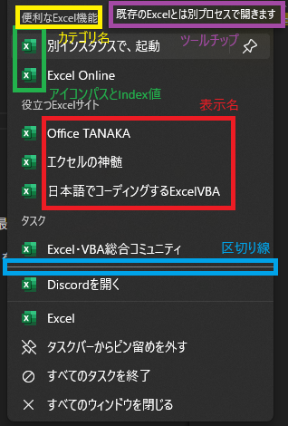

#### サンプルコード

下記を実行すると、上記画像のようになります。

```bas
Sub Demo_JumpList()
    '-----入力件数分、ジャンプリスト登録データを追加-----
    Registration "別インスタンスで、起動", Application.Path & "\EXCEL.EXE", "/x", "便利なExcel機能", "既存のExcelとは別プロセスで開きます"
    Registration "Excel Online", "https://excel.cloud.microsoft/", , "便利なExcel機能", "Web 用 Excel を開きます"

    Registration "Office TANAKA", "http://officetanaka.net/index.stm", , "役立つExcelサイト", "Excelのプロが運営するテクニック集のサイトです"
    Registration "エクセルの神髄", "https://excel-ubara.com/", , "役立つExcelサイト", "エクセル(Excel)およびマクロVBA全般について入門解説から上級者に役立つ技術情報まで幅広く発信しています。"
    Registration "日本語でコーディングするExcelVBA", "https://www.limecode.jp/", , "役立つExcelサイト", "「日本語の変数でプログラミングすれば、みんなが幸せになれる」というコンセプトの解説サイトです"
    
    Registration "Excel・VBA総合コミュニティ", "https://sites.google.com/view/excel-vba-fun", , , "Excel 好きが集まるDiscord コミュニティーホームページです。"
    Registration "※区切り線", ""
    Registration "Discordを開く", "https://discord.gg/JpWaGbSd7A", , , "Excel コミュニティーの招待リンクで開きます"
    

    '-----ジャンプリストへ追加-----
    Import


    '-----完了メッセージ-----
    MsgBox "登録完了しました。タスクバーの Excel を右クリックして、ご確認ください。", vbInformation, "ジャンプリスト"
End Sub
```

> [!CAUTION]
> - Excelの仕様上、ファイルを開くたびに、内容がリセットされるため、恒久的な設定はできません。
> - 区切り線は、カテゴリ名 = vbnullstring のみ効果があります

> [!TIP]
> - ジャンルリストの内容をクリアする場合は、`Registration` を呼び出さすに、`Import` を呼び出すことでクリア可能です。
> - `Import` に、Excel以外の AppUserModelID を引数に指定すると、そこに設定が反映されます。

## サムネイル ツールバーの設定方法

大まかな流れは下記になります

1. [ClsThumbButton.cls](doc\SampleForVBA\Class\ClsThumbButton.cls) をインポート
2. `InstallationButton` メソッドで、初期化
3. `SetProperty_THUMBBUTTON` メソッドで、必要な設定値を登録
4. `UpdateButton` メソッドで、対応する設定値を反映

### InstallationButton

ウィンドウハンドルを指定して初期化を行います。基本は、`Application.hwnd` でOKです。

> [!CAUTION]
> この初期化は、アクティブブックに対して、1回までにすること。セルに現在の `Application.hwnd` を残す等で、2回以上呼び出さないように工夫する必要があります。

### SetProperty_THUMBBUTTON

ボタンの設定情報を登録します。

#### 引数の説明

| 引数名         | 説明         | 既定値 |
|----------------|--------------------|---------|
| ProcedureAddress | VBA内のプロシージャ名アドレス | ※必須 |
| iconPath         | アイコンデータのあるフルパス | Application.Path & "\XLICONS.EXE" |
| iconIndex        | 複数アイコンがある場合の、Index値。| 0 |
| ButtonType       | [詳細はこちら](https://learn.microsoft.com/ja-jp/windows/win32/api/shobjidl_core/ne-shobjidl_core-thumbbuttonflags) | THBF_ENABLED |
| description      | ボタンにカーソルを当てた際のツールチップ | vbnullstring |

> [!CAUTION]
> ProcedureAddress は、「マクロ名」による文字列名称ではなく、`AddressOf [マクロ名]` という関数ポインタで登録する必要があります。


### サンプルコード

次のコードは、1つのボタンを追加し、そのボタンを押下すると、マクロ `Run01FromThumbnailToolbars` が実行されます。`InstallationButton` の2重実行を考慮してないので各自で工夫して下さい。

```bas
Sub Demo_ThumbnailToolbars()
    '必要な変数を定義
    Dim タスクバーボタン As New ClsThumbButton

    '設定を施す
    With タスクバーボタン
        'アクティブBookに対するハンドルに、ボタン設定を初期化(各アクティブな hwnd につき、1度のみ呼び出すこと)
        .InstallationButton = Application.hwnd
        
        '1個設定
        .SetProperty_THUMBBUTTON(AddressOf Run01FromThumbnailToolbars, , , , "クリックしてマクロ発動") = 1

        '設定を反映
        .UpdateButton = 1

		'通知させる
        MsgBox "登録完了しました。タスクバーの Excel にカーソルをあわせて、ご確認ください。", vbInformation, "サムネイルツールバー"
    End With
End Sub


'サムネイルツールバーから起動させるマクロ
Sub Run01FromThumbnailToolbars()
    MsgBox "1つ目のボタンを押しました", vbInformation, "Pushed"
End Sub
```

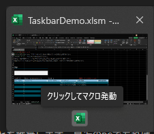

> [!TIP]
> - `SetProperty_THUMBBUTTON` メソッドによる設定情報は、7つまでです。よって、追加できるボタンの最大数も7つです。
> - 厳密には削除ではなく、非表示でボタンの増減を実現してます。

> [!CAUTION]
> アイコンなしでも登録可能ですが、一度でもアイコンを設定すると後から、削除ができません。アイコンパス変更は可能です。


# Attention
DLL側の処理は、ある程度のエラー処理を施していますが、決して完璧ではありません。<br>
そのため、DLLの関数を直接呼ぶのではなく、VBAの標準モジュール内のプロシージャを介して、エラー処理をしつつ、呼び出すことを推奨します。最近のPCであれば、誤差レベルです。