# TaskbarExtensionsVBA

Windows 7 以降で追加されたタスクバーに関するいくつかの機能を、**VBA 単体**（外部 DLL 不要）で操作できるようにしたものです。<br>
[タスク バーの拡張機能 - Win32 apps | Microsoft Learn](https://learn.microsoft.com/ja-jp/windows/win32/shell/taskbar-extensions)

VBAは非常に親しみやすく業務で根強く使われている一方、
比較的新しい Windows API には対応が難しいという課題があります。
例えば、タスクバーに関する機能（進捗バー、サムネイルボタン、ジャンプリストなど）は、
VBA単体で扱うにはハードルが高く、実用的ではありません。

そこで、`DispCallFunc` と VTable 経由の COM 呼び出しを組み合わせ、
**C++ 製 DLL を一切使わずに** VBA からタスクバー操作を行う方法を実装しました。
通常のVBAの延長として扱えるため、VBA開発者の方でもすぐに活用可能です。

✅ 外部 DLL の配布・読み込みが不要なので、導入のハードルがぐっと下がります。<br>
VBAの可能性を一気に広げる選択肢になるかもしれません。

あるいは、お遊び感覚で、タスクバーをいじるのも良いかも知れません。

## DEMO

### [進行状況バー](https://learn.microsoft.com/ja-jp/windows/win32/shell/taskbar-extensions#progress-bars)

| シチュエーション例 | 動作イメージ | 
| ---------------- | ------------ | 
| データ準備→処理中→終了 |        | 
| 処理中→一時中断→再開 |        |
| 処理中→エラー→終了 |        |

タスクバー ボタンに表示される進行状況インジケーターの種類と状態を設定できます。

### [アイコン オーバーレイ](https://learn.microsoft.com/ja-jp/windows/win32/shell/taskbar-extensions#icon-overlays)

| シチュエーション例 | 動作イメージ | 
| ---------------- | ------------ | 
| 検索中… | 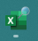       | 
| ファイル移動中… | 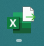       | 
| 処理中→エラー→終了 |        | 

こんな感じで、ステータスの表現が可能です。<br>
プログレスバーと合わせて表現すると良いと思います。

### [ジャンプリストのカスタム](https://learn.microsoft.com/ja-jp/windows/win32/shell/taskbar-extensions#customizing-jump-lists)

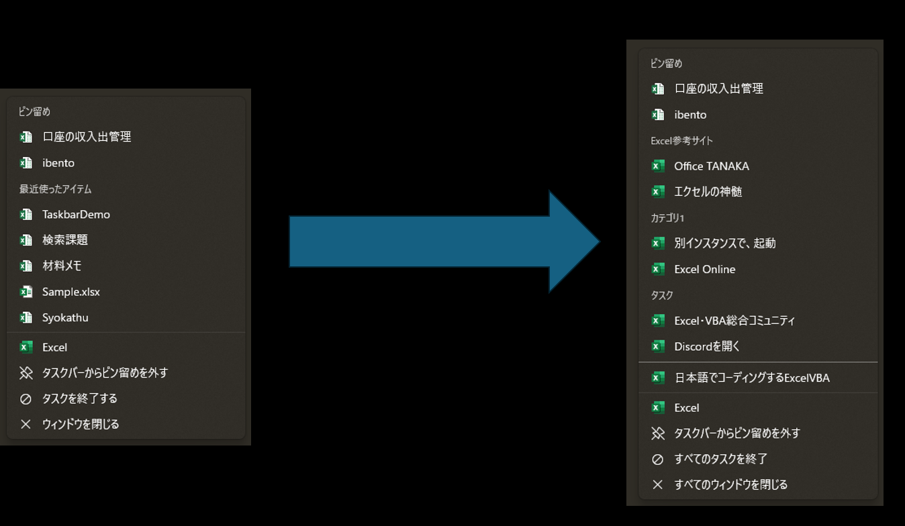

通常では「ピン留め」「最近使ったアイテム」しか見かけませんがこれを使うことで、任意のカテゴリ、タスク が扱えます。

### [サムネイル ツール バー](https://learn.microsoft.com/ja-jp/windows/win32/shell/taskbar-extensions#thumbnail-toolbars)

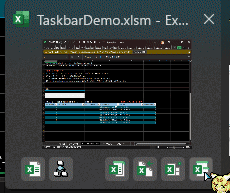

音楽プレイヤーなど一部のアプリでは、タスクバーのアイコンにマウスカーソルを乗せると、
サムネイルの下部に「再生」「停止」などの操作ボタンが表示されます。

そのサムネイル ツールバー機能をExcelに実装します。

## Features

- **外部 DLL 不要** — VBA モジュールをインポートするだけで、数行で手軽に進捗状況とステータスの表現が可能です。ユーザーフォーム作ってプログレスバーを埋め込んで、呼び出して…　という手間が省けます。
- ステータスに使えるアイコンソースファイルは、下記に対応しています
  - .icoファイル: 単独のアイコンファイル。
  - .exeファイル: 実行ファイル内に埋め込まれたリソースアイコン。
  - .dllファイル: DLL内に埋め込まれたリソースアイコン。

## Requirement

以下で検証済みです。

- Microsoft 365 Excel 64bit
- Windows 10 , 11 64bit

タスクバーのプログレスバー自体は、Windows 7から実装されたものですが当本人、所有していないためWin 10未満のOSは、未検証です…<br>
Office製品も同様です。

> [!IMPORTANT]
> サムネイルツールバーのクリック検知には `ITaskbarSubclassHandler.cls` が **64 ビット VBA (x64)** を前提としています。32 ビット版 Office では動作しません。

## Setup

### コアファイル（必須）

VBE で以下の 3 ファイルをインポートしてください。

| ファイル | 種類 | 役割 |
| -------- | ---- | ---- |
| [package/ITaskbarList3.cls](package/ITaskbarList3.cls) | クラス | プログレスバー・オーバーレイアイコン・サムネイルツールバー |
| [package/ITaskbarSubclassHandler.cls](package/ITaskbarSubclassHandler.cls) | クラス | サムネイルツールバーのクリック検知（ウィンドウサブクラス） |
| [package/ICustomDestinationList.bas](package/ICustomDestinationList.bas) | 標準モジュール | ジャンプリスト制御 |

### 便利ラッパー（任意）

よく使う操作をシンプルなプロシージャ名で呼び出せるラッパーモジュールです。

| ファイル | 役割 |
| -------- | ---- |
| [package/Demo/Mod04_ProgressBarTaskbar.bas](package/Demo/Mod04_ProgressBarTaskbar.bas) | `UpdateTaskbarProgress` など |
| [package/Demo/Mod01_BadgeUpdateManager.bas](package/Demo/Mod01_BadgeUpdateManager.bas) | `UpdateTaskbarOverlayIcon` など |
| [package/Demo/Mod03_ThumbnailToolbar.bas](package/Demo/Mod03_ThumbnailToolbar.bas) | サムネイルツールバーのデモ |
| [package/Demo/Mod05_JumplistControl.bas](package/Demo/Mod05_JumplistControl.bas) | ジャンプリストのデモ |

> [!TIP]
> ラッパーを使わず、`ITaskbarList3` クラスのメソッドを直接呼び出しても構いません。

## Usage

基本的には、上記のモジュールやクラスファイルをインポートするだけで済みます。詳しい内容は、次の項で説明します。

## UpdateTaskbarProgress

> [!IMPORTANT]
> 事前に [Mod04_ProgressBarTaskbar.bas](package/Demo/Mod04_ProgressBarTaskbar.bas) と [ITaskbarList3.cls](package/ITaskbarList3.cls) のインポートをして下さい。

### サンプルコード

```bas
Sub TaskbarProgressTest()
    UpdateTaskbarProgress 50
End Sub
```

上記のサンプルを実行すると、このようになります。進捗値 50% と表現できます。<br>
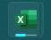

### 引数の説明

| 名称            | 説明                                                                             | 既定値 |
| --------------- | -------------------------------------------------------------------------------- | --- |
| current         | 現在の進捗値                                                                     | ※必須 |
| maximum         | 最大(ゲージMax)とする値。                                       | 100 |
| Status          | プログレスバーの状態(0,1,2,4,8 のいずれか)                                        | 2 (TBPF_NORMAL) |
| hwnd            | 適用させるウィンドウハンドルを指定。<br>基本は設定不要です。 | Application.hwnd |

### Status について

説明は[こちらから引用](https://learn.microsoft.com/ja-jp/windows/win32/api/shobjidl_core/nf-shobjidl_core-itaskbarlist3-setprogressstate)しています

| 値  | 説明                                                                                                                                              | イメージ | 
| --- | ------------------------------------------------------------------------------------------------------------------------------------------------- | -------- | 
| 0   | TBPF_NOPROGRESS<br>進行状況の表示を停止し、ボタンを通常の状態に戻します。                                                                         |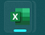| 
| 1   | TBPF_INDETERMINATE<br>進行状況インジケーターのサイズは拡大しませんが、タスク バー ボタンの長さに沿って繰り返し循環します。                        || 
| 2   | TBPF_NORMAL<br>進行状況インジケーターのサイズは、完了した操作の推定量に比例して左から右に大きくなります。                                         || 
| 4   | TBPF_ERROR<br>進行状況インジケーターが赤に変わり、進行状況をブロードキャストしているいずれかのウィンドウでエラーが発生したことを示します。        |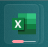| 
| 8   | TBPF_PAUSED<br>進行状況インジケーターが黄色に変わり、進行状況は現在いずれかのウィンドウで停止されていますが、ユーザーが再開できることを示します。 |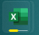| 

## UpdateTaskbarOverlayIcon

> [!IMPORTANT]
> 事前に [Mod01_BadgeUpdateManager.bas](package/Demo/Mod01_BadgeUpdateManager.bas) と [ITaskbarList3.cls](package/ITaskbarList3.cls) のインポートをして下さい。

### サンプルコード

```bas
Sub SetOverlayIconExample()
    Dim dllPath As String
    Dim iconIndex As Long
    Dim description As String
    
    ' 任意のアイコンデータがあるフルパス(ico,dll,exe に対応)
    'dllPath = "C:\Program Files\Microsoft Office\root\Office16\XLICONS.EXE"
    dllPath = "C:\Windows\System32\shell32.dll"
    'dllPath = "C:\Users\user\Downloads\sample.ico"

    ' アイコンのインデックス（DLL,exe内のアイコン番号）
    iconIndex = 240
    
    ' アイコンの説明テキスト
    description = "Custom Icon"
    
    UpdateTaskbarOverlayIcon dllPath, iconIndex, description
End Sub
```

上記のサンプルをWin 11で実行すると、このようになります。<br>
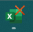

### 引数の説明

| 名称            | 説明                                                                             | 既定値 |
| --------------- | -------------------------------------------------------------------------------- | --- |
| dllPath         | 任意のアイコンデータがあるフルパス | ※必須 |
| iconIndex       | アイコンのインデックス（DLL,exe内のアイコン番号）<br>icoファイルの場合は、この設定を無視します。| 0 |
| description     | アクセシビリティ用の代替テキスト | 空文字 |
| hwnd            | 適用させるウィンドウハンドルを指定。<br>基本は、設定不要です。 | Application.hwnd |

> [!TIP]
> ステータスアイコンを除去するには、 iconIndex を -1 にすればOKです。


## ジャンプリストの登録方法

大まかな流れは下記になります

1. [ICustomDestinationList.bas](package/ICustomDestinationList.bas) をインポート
2. `Registration` 関数で、必要な設定値を登録
3. `Import` 関数で、ジャンプリストを登録

> [!NOTE]
> ジャンプリストの実体は、ショートカットファイルのようなイメージです。ここで、マクロ実行はできません。

### Registration 

ここで、ジャンプリストの登録データを定義します

| 引数名           | 説明                                                                 | 既定値 |
|------------------|----------------------------------------------------------------------| ----- |
| 表示名           | ジャンプリストにそのまま表示される名前を指定します。                | ※必須
| ショートカットコマンド | 起動するアプリのパスやURLを指定します。リスト項目をクリックした際に実行されます。 <br> これを省略すると、区切り線扱いとして登録されます | ※必須扱いだが、空欄可 |
| コマンド引数     | 起動時に渡す追加の引数を指定します。例：「EXCEL.EXE /x」の「/x」など。     | vbnullstring |
| カテゴリ名       | リストの分類名を指定します。未入力の場合は「タスク」という既定のカテゴリになります。 | vbnullstring |
| ツールチップ      | 項目にマウスカーソルを当てたときに表示される補足説明を指定します。     | vbnullstring |
| アイコンパス      | リスト項目の左側に表示されるアイコンのファイルパスを指定します。         | Application.Path & "\XLICONS.EXE" |
| アイコンIndex    | アイコンファイル内に複数アイコンがある場合、その中のどれを使うかを指定します（インデックス番号）。 | 0 |

区切り線を入れる場合は `RegistrationSeparator` を使います（タスクセクション専用）。

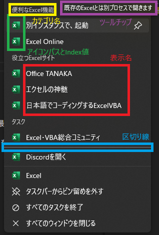

#### サンプルコード

下記を実行すると、上記画像のようになります。

```bas
Sub Demo_JumpList()
    Registration "別インスタンスで、起動", Application.Path & "\EXCEL.EXE", "/x", "便利なExcel機能", "既存のExcelとは別プロセスで開きます"
    Registration "Excel Online", "https://excel.cloud.microsoft/", , "便利なExcel機能", "Web 用 Excel を開きます"

    Registration "Office TANAKA", "http://officetanaka.net/index.stm", , "役立つExcelサイト", "Excelのプロが運営するテクニック集のサイトです"
    Registration "エクセルの神髄", "https://excel-ubara.com/", , "役立つExcelサイト", "エクセル(Excel)およびマクロVBA全般について入門解説から上級者に役立つ技術情報まで幅広く発信しています。"
    Registration "日本語でコーディングするExcelVBA", "https://www.limecode.jp/", , "役立つExcelサイト", "「日本語の変数でプログラミングすれば、みんなが幸せになれる」というコンセプトの解説サイトです"
    
    Registration "Excel・VBA総合コミュニティ", "https://sites.google.com/view/excel-vba-fun", , , "Excel 好きが集まるDiscord コミュニティーホームページです。"
    RegistrationSeparator
    Registration "Discordを開く", "https://discord.gg/JpWaGbSd7A", , , "Excel コミュニティーの招待リンクで開きます"

    Import

    MsgBox "登録完了しました。タスクバーの Excel を右クリックして、ご確認ください。", vbInformation, "ジャンプリスト"
End Sub
```

> [!CAUTION]
> - Excelの仕様上、ファイルを開くたびに、内容がリセットされるため、恒久的な設定はできません。
> - 区切り線は、タスクセクションのみ効果あります

> [!TIP]
> - ジャンプリストの内容をクリアする場合は、`Clear` を呼び出してください。
> - `Import` に、Excel以外の AppUserModelID を引数に指定すると、そこに設定が反映されます。

## サムネイル ツールバーの設定方法

大まかな流れは下記になります

1. [ITaskbarList3.cls](package/ITaskbarList3.cls) と [ITaskbarSubclassHandler.cls](package/ITaskbarSubclassHandler.cls) をインポート
2. `InitThumbBar` メソッドで、初期化
3. `ConfigureThumbButton` メソッドで、必要な設定値を登録
4. `UpdateThumbButton` メソッドで、対応する設定値を反映

### InitThumbBar

ウィンドウハンドルを指定して初期化を行います。基本は、`Application.hwnd` でOKです。
各アクティブな hwnd につき、1度のみ呼び出してください。

### ConfigureThumbButton

ボタンの設定情報を登録します。

#### 引数の説明

| 引数名         | 説明         | 既定値 |
|----------------|--------------------|---------|
| buttonIndex   | ボタン番号（1 ～ 7） | ※必須 |
| ProcedureName | VBE内のプロシージャ名 | ※必須 |
| IconPath         | アイコンデータのあるフルパス | Application.Path & "\XLICONS.EXE" |
| IconIndex        | 複数アイコンがある場合の、Index値。| 0 |
| ButtonType       | [詳細はこちら](https://learn.microsoft.com/ja-jp/windows/win32/api/shobjidl_core/ne-shobjidl_core-thumbbuttonflags) | THBF_ENABLED |
| Description      | ボタンにカーソルを当てた際のツールチップ | vbnullstring |

> [!CAUTION]
> - できるだけ、ブック内にてプロシージャ名は、ユニークにしてください。  
> どーーしてもなら、`Module1.Run01FromToast` という書き方でも動作します。
> - スコープ範囲は、ブックレベルまでです。

### サンプルコード

次のコードは、1つのボタンを追加し、そのボタンを押下すると、マクロ `Run01FromThumbnailToolbars` が実行されます。

> [!IMPORTANT]
> `ITaskbarList3` は、内部で COM オブジェクトやウィンドウサブクラスを保持しています。
> プロシージャ内の `Dim` だけで生成すると、処理終了後にオブジェクトが破棄され、ボタン表示やクリック検知が効かなくなります。
> **`Static` やモジュールレベルの変数など、処理後もオブジェクトを保持する書き方**にしてください。

```bas
Sub Demo_ThumbnailToolbars()
    Static taskbar As New ITaskbarList3

    With taskbar
        .InitThumbBar Application.hwnd
        .ConfigureThumbButton 1, "Run01FromThumbnailToolbars", , , , "クリックしてマクロ発動"
        .UpdateThumbButton 1

        MsgBox "登録完了しました。タスクバーの Excel にカーソルをあわせて、ご確認ください。", vbInformation, "サムネイルツールバー"
    End With
End Sub


Sub Run01FromThumbnailToolbars()
    MsgBox "1つ目のボタンを押しました", vbInformation, "Pushed"
End Sub
```

モジュールレベルで保持する例:

```bas
Private m_taskbar As ITaskbarList3

Sub SetupThumbnailToolbars()
    If m_taskbar Is Nothing Then Set m_taskbar = New ITaskbarList3
    m_taskbar.InitThumbBar Application.hwnd
    ' ...
End Sub
```

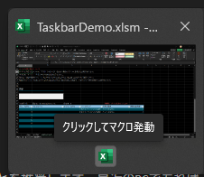

> [!NOTE]
> - 1つのウィンドウにつき7つまでボタンを設定できます。
> - 厳密には削除ではなく、非表示でボタンの増減を実現してます。

> [!IMPORTANT]
> リボンの`表示`→`新しいウィンドウを開く`で実質無限にボタンを設定できますが、現実的ではないのでやめましょう

> [!CAUTION]
> アイコンなしでも登録可能ですが、一度でもアイコンを設定すると後から、削除ができません。アイコンパス変更は可能です。

## 技術メモ

本プロジェクトのコア実装は、Windows API を C++ DLL にラップするのではなく、
VBA から直接 COM インターフェイス（`ITaskbarList3` / `ICustomDestinationList` など）を
`DispCallFunc` + VTable 呼び出しで操作しています。

サムネイルツールバーのクリック検知には、ウィンドウサブクラス（`SetWindowSubclass`）と
実行可能メモリ上のサンク（thunk）を組み合わせた `ITaskbarSubclassHandler` を使用しています。

> [!NOTE]
> リポジトリ内の `TaskbarExtensionsVBA/` フォルダには、旧来の C++ DLL 版のソースコードが残っていますが、現在の推奨利用方法は `package/` 配下の VBA ファイルです。

# Attention

COM 呼び出しやサブクラス処理は、ある程度のエラー処理を施していますが、決して完璧ではありません。<br>
そのため、可能であればラッパーモジュール内のプロシージャを介して、エラー処理をしつつ呼び出すことを推奨します。
